Let's bring the data to the cloud this time! 💾 ☁
We'll be using the free cluster of Mongo DB Atlas

## What is Mongo DB Atlas?

> Mongo DB Atlas is a fully-managed database-as-a-service available on AWS, Azure, and GCP

Previously mLab, Atlas is the easiest and fastest way to have a mongo db.**Why?**

- Quick, simple, and fast: no installation and config files. After signing up and creating a cluster (takes 5 minutes), you're all set.

- It's in the cloud: not running in your machine as a Mongo service, nor in a disk file like `diskdb` . You can manage it from anywhere through the Atlas web app. For your app, you only need a connection URL to access the db.

- Very cool UI: Atlas dashboard is very intuitive, and first-time users will find it easy with the visual cues and steps

`db.js`

# Cloud setup

### 1. First sign up here:

https://www.mongodb.com/atlas-signup-from-mlab

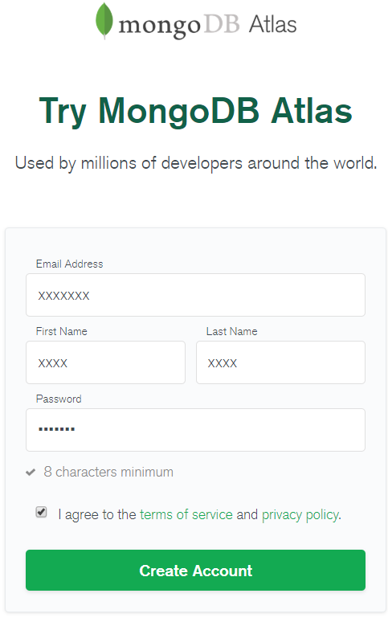

### 2. Create a free cluster

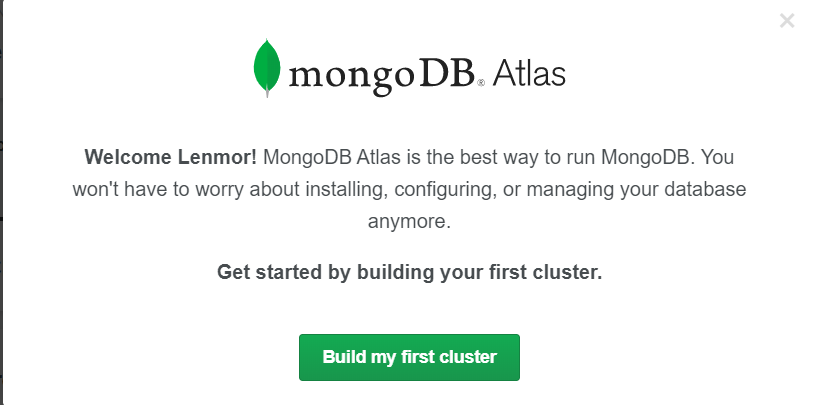

The free tier M0 comes with 512 MB Storage, shared RAM and vCPU.
This should be enough for our starter Node project.

For _Cluster region_, you can pick any provider (AWS, Google, Azure) and the region one closest to you that has a Free Tier.

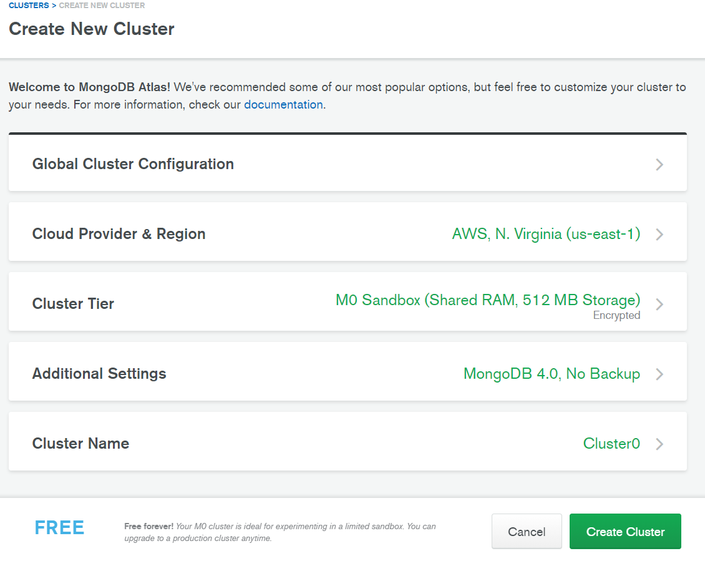

You'll be taken now to the Dashboard which indicates all the steps to be taken

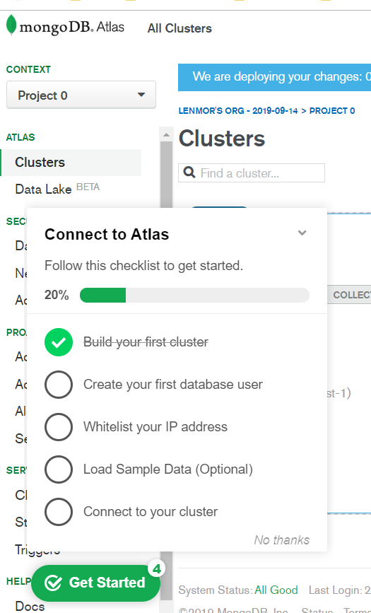

The UI is quite intuitive with cues and steps so I'll skip some details along the way.

### 3. Create first database user

Let's create a user with default read/write access.

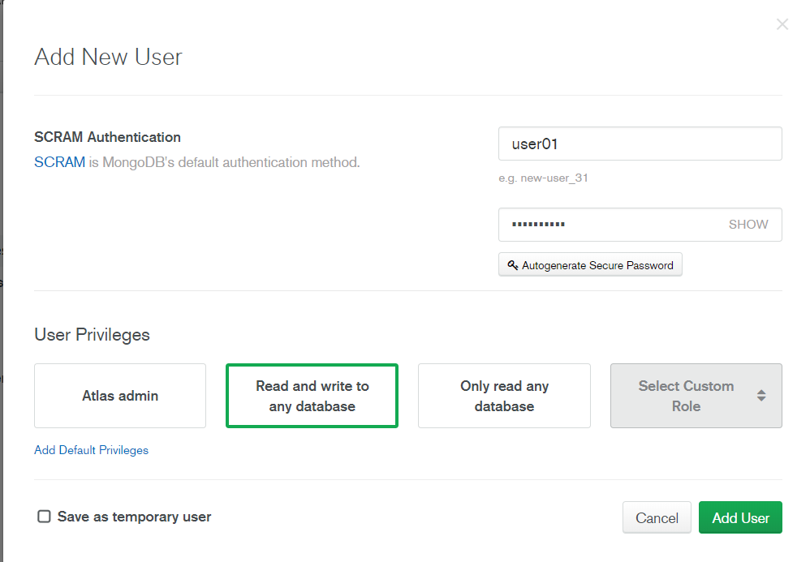

### 4. Whitelist IP Address

For a real application, you'll probably want to limit access by adding only your current IP address.

But for simplicity, we'll allow access from anywhere ( `0.0.0.0` )

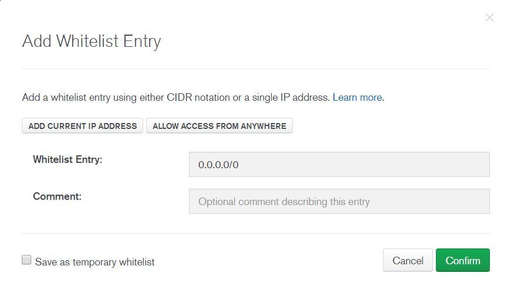

### 5. Add sample data

From the cluster view, click "Connections", then "Add my Own Data"

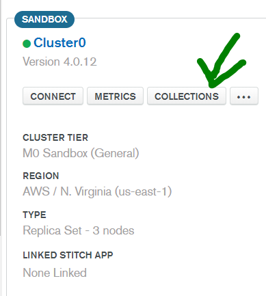

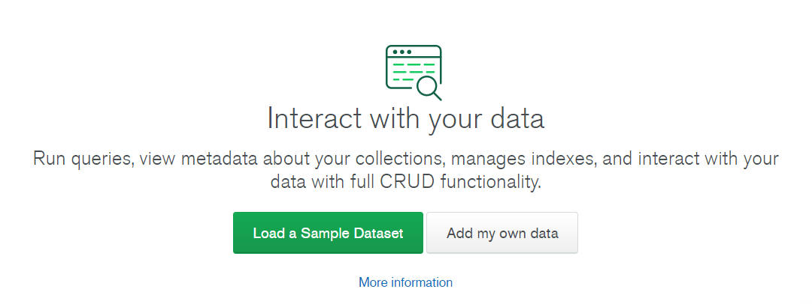

Same as the last time, we use `data` as the db name
and `movies` as the collection name

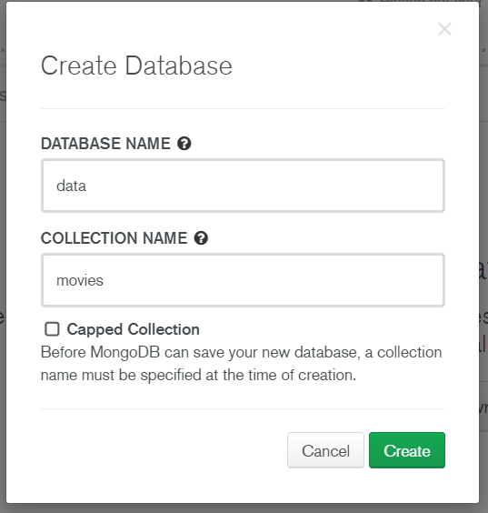

Click Create

Now we can **Insert Document**

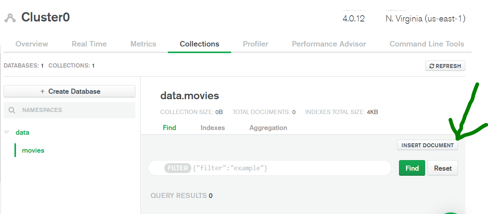

We use similar data as before. Insert.

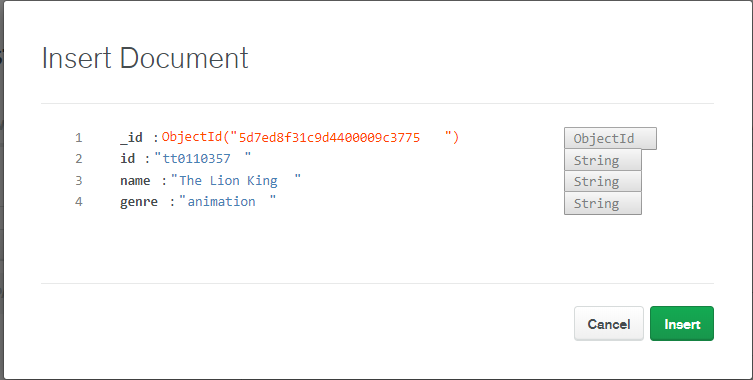

Now we see the inserted data in the dashboard.
Add more as you wish

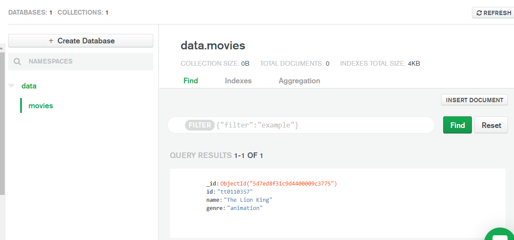

### 5. Connect to cluster

Go back to the Clusters view, then click Connect in our cluster.

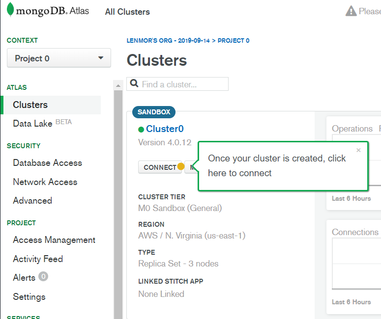

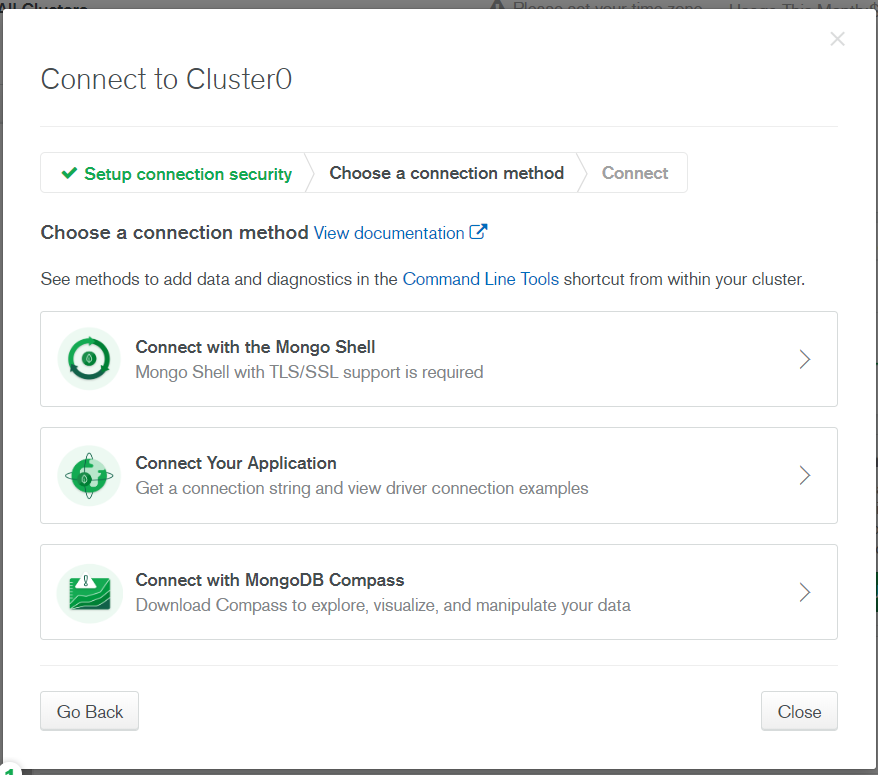

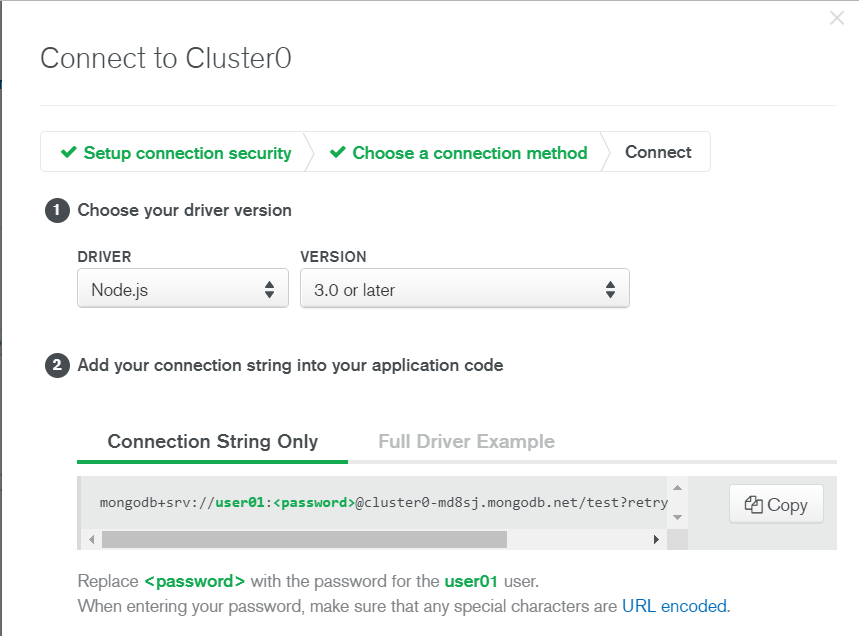

Copy the _Connection String_, since we'll use this in the next step.

### 6 Install `mongodb` driver

```bash
$ npm install mongodb
```

Now that we have the connection code and the mongodb driver,
we're ready to dive into code!

# Connecting to the db

1. Grab starter code:

You can grab the code from last chapter here:

https://github.com/lenmorld/devto_posts/tree/master/quick_node_express_diskdb

2. Create a new file called `db.js` in the app root

Paste the connection string in the `dbConnectionUrl`

⚠ Don't forget to replace password with your db user password, without the `<>` symbols.

```javascript
// db.js
// import and use mongodb.MongoClient
const mongodb = require("mongodb");
const MongoClient = mongodb.MongoClient;

const dbConnectionUrl = "CONNECTION_STRING_FROM_ATLAS";

function initialize(
	dbName,
	dbCollectionName,
	successCallback,
	failureCallback
) {
	MongoClient.connect(dbConnectionUrl, function(err, dbInstance) {
		if (err) {
			console.log(`[MongoDB connection] ERROR: ${err}`);
			failureCallback(err); // this should be "caught" by the calling function
		} else {
			const dbObject = dbInstance.db(dbName);
			const dbCollection = dbObject.collection(dbCollectionName);

			console.log("[MongoDB connection] SUCCESS");
			successCallback(dbCollection);
		}
	});
}

module.exports = {
	initialize
};
```

3. We'll start `server.js` from scratch, since we will be using the database connection instead of `diskdb` instead

```javascript
// server.js

const express = require("express");
const server = express();

const body_parser = require("body-parser");
// parse JSON (application/json content-type)
server.use(body_parser.json());

const port = 4000;

const db = require("./db");
const collectionName = "movies";

// TODO: db init

server.listen(port, () => {
	console.log(`Server listening at ${port}`);
});
```

4. Initialize the database connection.

Place this snippet in the `// TODO: db init` marker

```javascript
// db.js
...
db.initialize(dbName, collectionName, function(dbCollection) { // successCallback
    // get all items
    dbCollection.find().toArray(function(err, result) {
        if (err) throw err;
        console.log(result);
    });

    // TODO: db CRUD routes

}, function(err) { // failureCallback
    throw (err);
});
...
```

5. Start server

```bash
$ npm install
$ npm start
```

...which should give:

```bash
Server listening at 5000
[MongoDB connection] SUCCESS
[ { _id: 5d7ed8f31c9d4400009c3775,
    id: 'tt0110357',
    name: 'The Lion King',
    genre: 'animation' } ]
```

# CRUD routes

Since we use `mongodb` as well, there are some similarities from last post's `diskdb` client to `MongoClient`. There are quite some differences though, so we'll go through them one by one.

- `cb` stands for callback, which is the code to execute after successful db operation

| CRUD Operation | REST operation      | MongoClient Operation                              |
| -------------- | ------------------- | -------------------------------------------------- |
| Create         | POST `/items`       | `dbCollection.insertOne(object, cb)`               |
| Read One       | GET `/items/:id`    | `dbCollection.findOne(query cb)`                   |
| Read All       | GET `/items`        | `dbCollection.find(query).toArray(cb)`             |
| Update         | PUT `/items/:id`    | `dbCollection.updateOne(query, { $set: obj }, cb)` |
| Delete         | DELETE `/items/:id` | `dbCollection.deleteOne(query, cb)`                |

All of these routes go inside the `// TODO: db CRUD routes` marker

### i. Create ➕

```javascript
server.post("/items", (req, res) => {
	const item = req.body;
	dbCollection.insertOne(item, (err, result) => {
		if (err) throw err;
		// return updated list
		dbCollection.find().toArray((_err, _res) => {
			if (_err) throw _err;
			res.json(_res);
		});
	});
});
```

Test:

```bash
$ curl -X POST -H "Content-Type: application/json" --data '{"id": "tt0109830", "name": "Forrest
Gump", "genre": "drama"}' http://localhost:4000/items

[{"_id":"5d7ed8f31c9d4400009c3775","id":"tt0110357","name":"The Lion King","genre":"animation"},{"_id":"5d7ee33995b48b54ecb5dae0","id":"tt0109830","name":"Forrest Gump","genre":"drama"}]
```

TODO:>>>>>>

### ii. Read one 🕵️

```javascript
server.get("/items/:id", (req, res) => {
	const itemId = req.params.id;
	const items = db.movies.find({
		id: itemId
	});
	if (items.length) {
		res.json(items);
	} else {
		res.json({
			message: `item ${itemId} doesn't exist`
		});
	}
});
```

### iii. Read all 🕵️

```javascript
server.get("/items", (req, res) => {
	dbCollection.find().toArray((_err, _res) => {
		if (_err) throw _err;
		res.json(_res);
	});
});
```

### iv. Update ✏️

```javascript
server.put("/items/:id", (req, res) => {
	const itemId = req.params.id;
	const item = req.body;
	console.log("Editing item: ", itemId, " to be ", item);

	db.movies.update(
		{
			id: itemId
		},
		item
	);

	res.json(db.movies.find());
});
```

### v. Delete ❌

```javascript
server.delete("/items/:id", (req, res) => {
	const itemId = req.params.id;
	console.log("Delete item with id: ", itemId);

	db.movies.remove({
		id: itemId
	});

	res.json(db.movies.find());
});
```

## Test it out

Add a new one.

```bash
$ curl -X POST -H "Content-Type: application/json" --data '{"id": "tt0109830", "name": "Forrest Gump", "genre": "drama"}' http://localhost:4000/items
```

Fetch all.
From browser: http://localhost:4000/items

Fetch one.
From browser: http://localhost:4000/items/tt0110357

Update it.
Maybe you think Forrest Gump is an action movie, because of all the war sequences and all the running.🔫🎖️🏃‍♂️

```bash
$ curl -X PUT -H "Content-Type: application/json" --data '{"genre": "action"}' http://localhost:4000/items/tt0109830

...{"id":"tt0109830","name":"Forrest Gump","genre":"action"}...
```

Delete it.

```bash
curl -X DELETE http://localhost:4000/items/tt0468569
```
